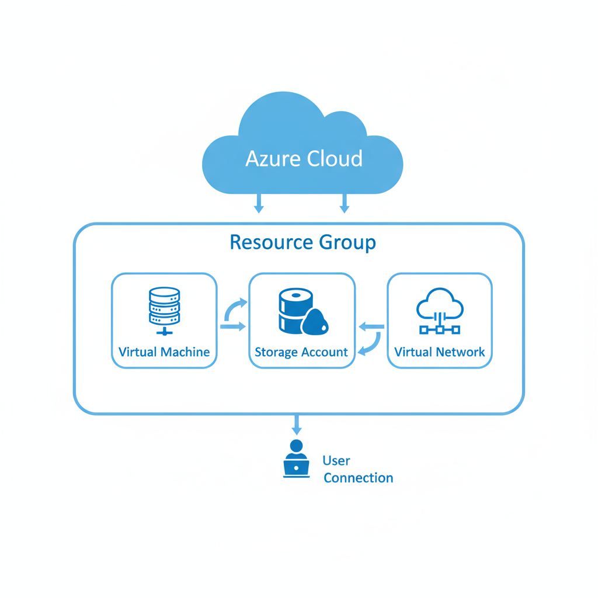

## VM + Network + Storage Project

**Purpose:**  
This project demonstrates deploying and managing core Azure resources. It includes:  
- A Virtual Machine (VM) connected to a Virtual Network (VNet)  
- A Storage Account attached to the VM  
- Network Security Group (NSG) for traffic control  
- Basic monitoring using Azure Monitor  

**Skills Demonstrated:**  
- Azure Resource Group management  
- VM deployment and configuration  
- Virtual Network and subnet setup  
- Storage management  
- Security and monitoring setup  

**Architecture Diagram:**  

